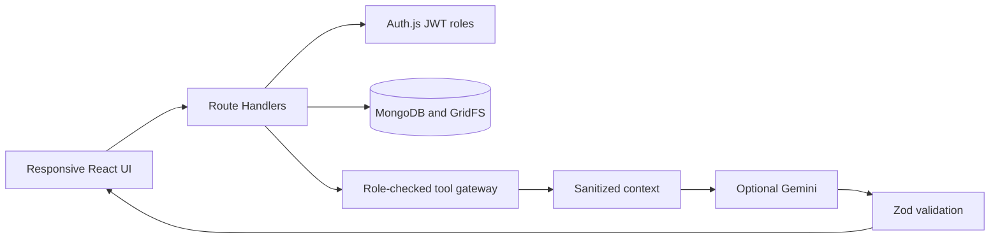
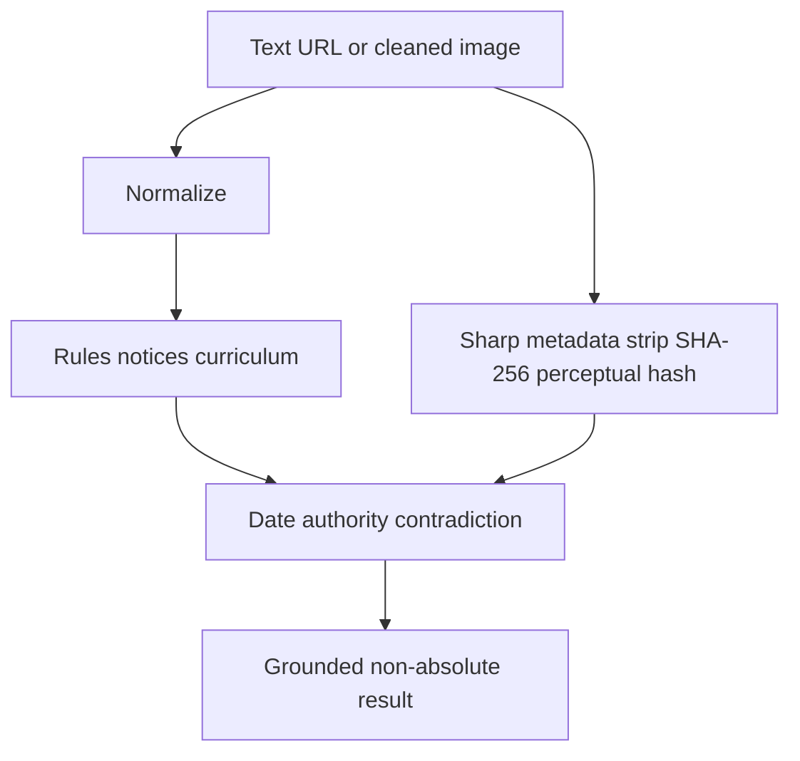
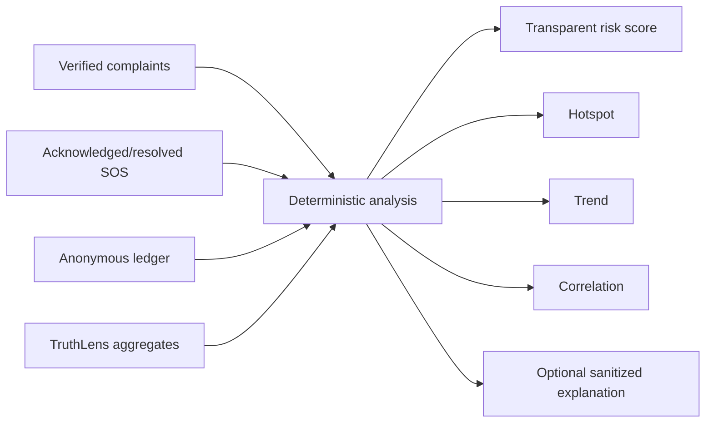
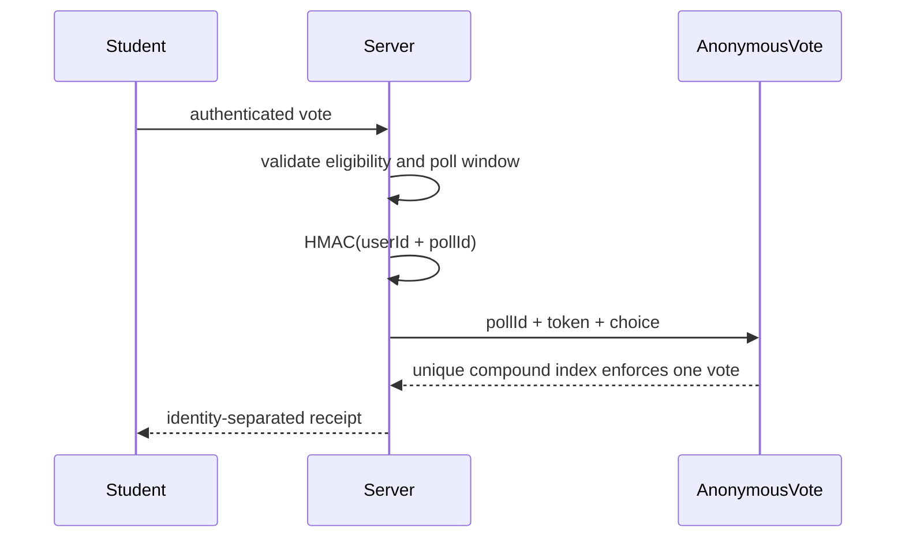

# Architecture

The application remains one Next.js App Router deployment. Route Handlers authenticate, validate with Zod, authorize roles, execute deterministic services, and persist through Mongoose. MongoDB is the only application database.

Gemini never receives a database connection or raw complaint/SOS evidence. Chat messages store grounded citations but not confidential source material.

TruthLens stores anonymous checks and safe technical indicators. Fingerprints support duplicate detection; binary uploads are not retained by this module.

Rejected complaints are excluded and pending complaints do not affect the score. No service changes a role, deletes an account, or punishes a person.

Cross-module flow: report → verify → correlate → detect patterns → explain → vote/respond → track action → prevent repetition. Recurring issues may suggest a proposal, but only a teacher can approve/open a vote. Three verified strikes only establish impeachment eligibility; an authorized teacher must open the vote.
