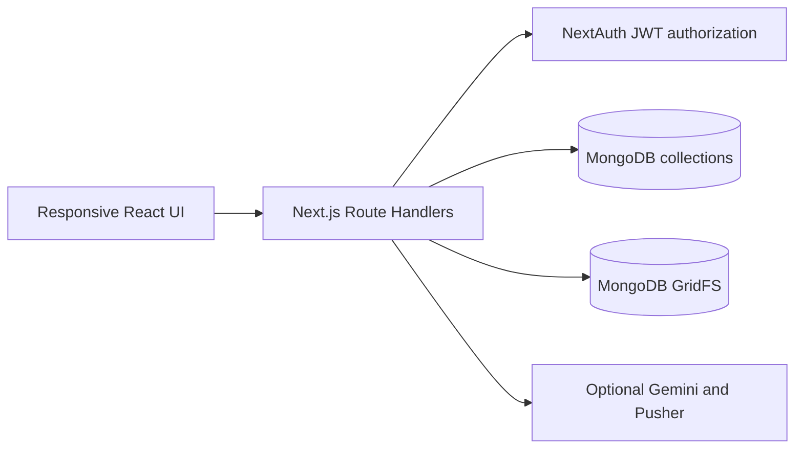

# Architecture

The application is one Next.js App Router deployment. Client pages call relative `/api/*` Route Handlers; handlers perform authentication, Zod validation, authorization, business logic, and Mongoose persistence. There is no separate backend.

The central trust boundary is the schema. `Complaint`, `LedgerEntry`, and `SosAlert` cannot store student/session references. An authenticated ID is used transiently to create a daily complaint HMAC in `SubmissionLimit`; it has no complaint ID and expires. Evidence is re-encoded before GridFS storage.

Mongoose connections are cached. Indexes cover unique IDs, statuses, lookup hashes, and TTL limits. Binary processing uses the Node runtime. Seating reserves invalid seats, honors fixed/accessibility placement, then sorts by height. Curriculum becomes overlapping chunks; retrieval returns exact stored source text and rejects weak matches.
